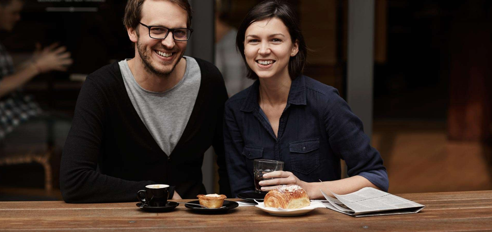

# Project6

This project is named project6.

## APP

## ABOUT

This page is a representation of a figma project

## Built With

- HTML
- CSS
- Google Chrome

## Clone project

- To get a local copy up and running follow these simple example steps.
- Clone this repository with
`https://github.com/kadjialan/figma-page-html` using your terminal.
- Change to the project directory by entering: cd wedding in the terminal.

## Command-line steps

- $ git clone `$ https://github.com/kadjialan/figma-page-html`
- $ `cd figma6`
- $ `git checkout feature/readme`

## Start App

- run any browser(google chrome, safari)

## Prerequisites

Knowledge about:

- HTML
- CSS
- Google Chrome

## Live Site

[Link]( https://kadjialan.github.io/figma-page-html/)

## Author

👤 **Kadji Alan**

- GitHub: [@kadji alan](https://github.com/kadjialan/)

## 🤝 Contributing

Contributions, issues, and feature requests are welcome!

Feel free to check the [issues page](https://github.com/kadjialan/figma-page-html/issues).

## Show your support

Give a ⭐️ if you like this project!